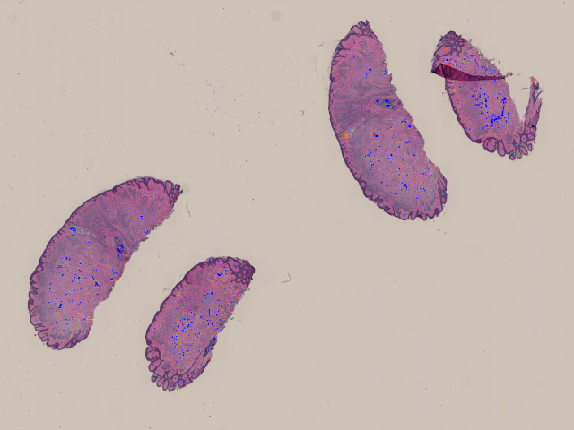

# LIODet: Large Image Object Detection Library

Tools for performing object detection on extremely large images that cannot be fully loaded into memory.

> [!IMPORTANT]
> LIODet is **NOT** an object detection library. Instead, it is a set of tools to aid in performing object detection on extremely large images. Object detection is **NOT** the focus of this library. The provided object detection code is for illustrative purposes only.

## Credits and Citation

- **Author**: Antoni Burguera (antoni dot burguera at uib dot es)
- **Citation**: If you use this library, please contact us to determine the appropriate citation.

## Contents

- [Quick Start](#quick-start)
- [Examples](#examples)
- [Understanding the System](#understanding-the-system)
- [Requirements](#requirements)

## Basic usage

1. **Import functions and libraries**

```python
from liodet import globalParameters,get_blobs,plot_blobs
import openslide

```

> [!IMPORTANT] 
> LIODet works with *NDPI* files using the *openslide* library. Other formats may work through openslide though they have **NOT** been tested at all.

2. **Open the NDPI file**

```python
ndpiData=openslide.OpenSlide('PATH/TO/NDPI/FILE.ndpi')
```

3. **Modify the parameters**

LIODet groups all of its parameters into the dictionary globalParameters. The default values are:

```python
globalParameters = {
    'NDPI_LEVEL_LORES': 7,                  # NDPI level for coarse data check
    'NDPI_LEVEL_HIRES': 0,                  # NDPI level for fine image proc.
    'CROP_SIZE_LEVEL0': (4000, 4000),       # Base crop size
    'GAUSSIAN_BLUR_SIGMA_LEVEL0': 5,        # Sigma for Gaussian smoothing
    'SMALL_OBJECT_SIZE_LEVEL0': 1000,       # Min area for small objects
    'SMALL_HOLE_SIZE_LEVEL0': 1000,         # Min area for small holes
    'CLOSING_RADIUS_LEVEL0': 20,            # Radius for morphological closing
    'DELTA_OVERLAP_LEVEL0': 512,            # Max distance for bbox contiguity
    'MAX_TOUCH_RATIO': 0.25,                # Max allowed ratio of edge pixels
    'MIN_AREA_LEVEL0': 4000,                # Min area for objects of interest
    'FLOOD_FILL_START': (0, 0),             # Seed point for background fill
    'GRID_CROP_MARGIN': 0.1                 # Margin to enlarge each crop area
}

```

Parameters ending with LEVEL0 depend on the NDPI level or scale. These values refer to NDPI level 0 and are scaled automatically by LIODet when needed.

To modify a parameter, assign a new value in the dictionary. For example:

```python
globalParameters['NDPI_LEVEL_HIRES']=3
```

> [!TIP] 
> The highest resolution in an NDPI file is at level 0, making it the most detailed. Start with a lower resolution (e.g., level 3) to adjust parameters and switch to level 0 once fine-tuned.

4. **Process the NDPI file**

```python
theBlobs=get_blobs(ndpiData,globalParameters)
```

This can be time consuming, depending on the *globalParameters*. Some progress bars will be shown:

```
PROCESSING GRID  : [==================================================] 100%
ADJACENCY MATRIX : [==================================================] 100%
MERGING GROUPS   : [==================================================] 100%
```

5. **Save the results**

LIODet does not provide functionalities to save the results. External libraries such as *pickle* can be used.

```python
from pickle import dump
with open('PATH/TO/SAVE/RESULTS.pkl','wb') as outFile:
    dump(theBlobs,outFile)
```

After that, you can load the results as follows:

```python
from pickle import load
with open('PATH/TO/SAVE/RESULTS.pkl','rb') as inFile:
    theBlobs=load(inFile)
```

6. **Visualize the results**

You can easily obtain a global view of the detected objects by doing:

```python
import matplotlib.pyplot as plt

theImage=plot_blobs(ndpiData,theBlobs,2,globalParameters)
plt.figure(figsize=(20,20))
plt.imshow(theImage)
plt.show()
```

The third parameter (2 in this case) is the NDPI level that you want to use for plotting. This will result in something like:



> [!IMPORTANT]
> No NDPI file is provided. Sample results in this repository use the [CMU-1](https://cytomine.com/collection/cmu-1/cmu-1-ndpi) NDPI file (public domain license).

You can also save the image to easily inspect it with any image editor.

```python
from skimage.io import imsave

imsave('PATH/TO/SAVE/IMAGE.png',theImage)
```

7. **Interpret the results**

By zooming into that image, more details can be appreciated.


The color codes used are:

* **RED BLOB** : Problematic object (e.g., fails MIN_AREA_LEVEL0 checks).
* **ORANGE BLOB**: Correct object detected in step [*Object Joining*](#understanding-the-system).
* **BLUE BLOB**: Correct object detected in step [*Object Detection*](#understanding-the-system).
* **GREEN BOUNDING BOX**: Valid object.
* **RED BOUNDING BOX EDGES**: Expected continuation not found (warning).

Overall, blue and orange blobs and the corresponding bounding boxes can be used whilst red blobs should not be used.

The output of *get_blobs* is a list. Each item in this list has:

* **theMask** : The mask (binary image) of the blob. It is a 2D ndarray.
* **bbInfo**: It is a list with bounding box information as follows:
    * **rStart, cStart, rEnd, cEnd**: The bounding box coordinates (r=row, c=column). The scale is the NDPI level `globalParameters['NDPI_LEVEL_HIRES']`.
    * **numTouchTop, numTouchBottom, numTouchLeft, numTouchRight** : Number of undetected bounding boxes that should touch this one in each of the four directions.
    * **infoCode** : A code evaluating the blob. A value of 0 or 1 mean correct blob whilst a value of 2 means wrong blob. The difference between 0 and 1 is the stage at which the blob was fully detected. 0 means the blob fully lied in one cell of the regular grid and 1 means the blob is the result of joining several partial blobs.

## Examples

Two examples are included in the repository:

* **example_liodet.ipynb** : Jupyter Notebook walkthrough.
* **example_liodet.py** : A plain Python walkthrough.

Check these examples as well as LIODet code to learn about in-depth LIODet usage.

## Understanding the System

LIODet operates in the following steps:

* **Grid Creation**: Divides the images into manageable crops.
* **Object Detection**: Scans the crops to detect objects and handles partial detections.
* **Object Joining**: Combines partial detections across crops.

The object detection code is the `process_image` function in `liodet.py`. Modify it to have other object detection algorithms. The mask check code is the `check_mask` function in `liodet.py`. Modify it to use other rejection criteria.

## Requirements

* Python 3.8+
* Required libraries are listed in requirements.txt.

To install dependencies, run:

```python
pip install -r requirements.txt
```

## Disclaimer
The code is provided "as is." While it should run smoothly on most systems, there is a slight chance it could produce unexpected outcomes. In exceedingly rare cases, it might even disrupt the fabric of reality (rupturing space-time, summoning unspeakable horrors from beyond the veil, or triggering ancient prophecies best left forgotten). The author accepts no responsibility for temporal distortions, dimensional anomalies, or any eldritch entities you may inadvertently awaken. Proceed with caution... and perhaps a backup plan.